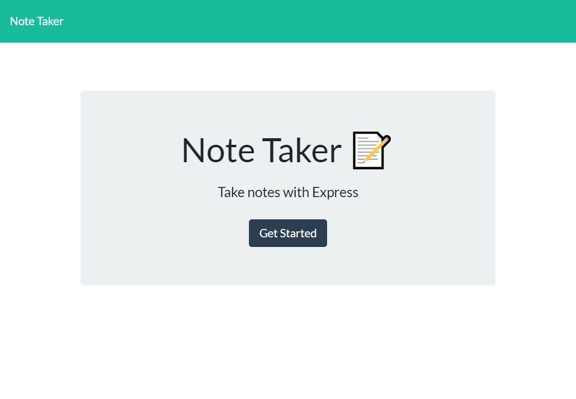
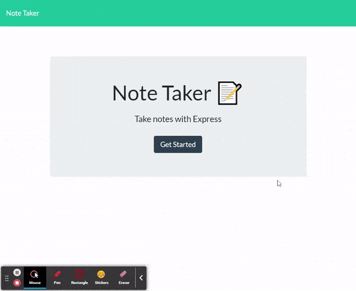

# Note-Taker


## Description
- Develop a Note Taker application to save and delete notes with an Express.js backend.
- A simple app that lets the user save notes and delete them when necessary.
- All notes are saved in the database and updated with each change with api calls.
- User inputs are validated before accepting.
- Each note is given a unique ID before being saved which is then used to retrieve the note to be deleted.
- Any URL endpoint returns the user back to the application landing page.

## Table of Contents
1. [Installation](#installation)
2. [Usage](#usage)
3. [License](#license)
4. [Contributing](#contributing)
5. [Tests](#tests)
6. [Questions](#questions)

## Installation
- Technologies used in this application are 'express' and 'uuid'.
- Application is deployed to heroku.
```bash
- git clone https://git.heroku.com/note-taker-daman29.git
- npm i // to install all dependencies
```

## Usage
- Visit the application homepage at [Heroku deployed link](https://note-taker-daman29.herokuapp.com/)
- Or run the application locally in terminal with "node server.js" then visiting [localhost:3001](http://localhost:3001/)

```bash
node server.js
```
The following image and gif show the web application's appearance and functionality.



- GIF Example



## License
- This application is licensed under the MIT License

## Contributing
- Clone repository first using git clone
- Contribute your changes to a new branch

## Tests
- No test commands

## Questions
- Reach me via email at damneet.sambhy@hotmail.com or issues on [github](https://github.com/daman29)